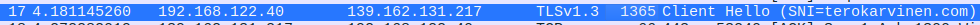
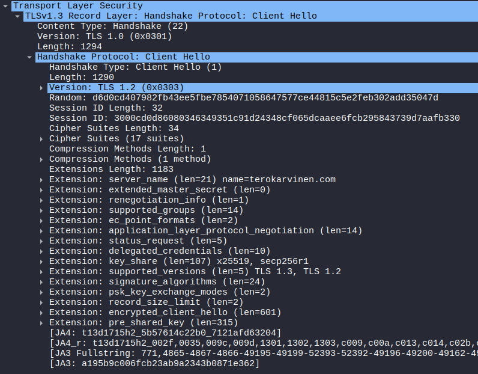
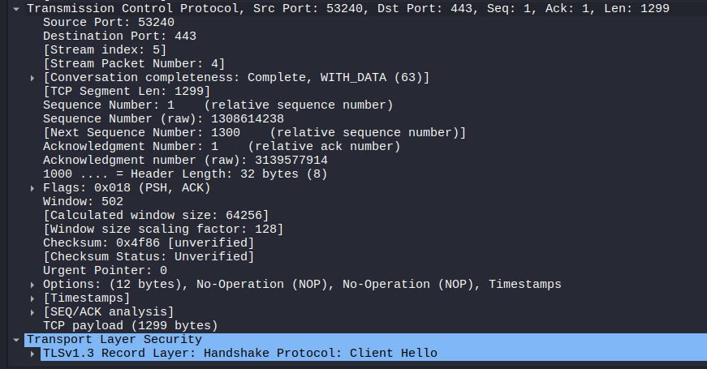
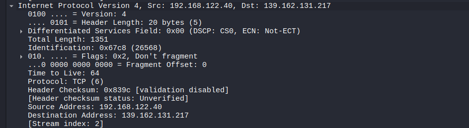
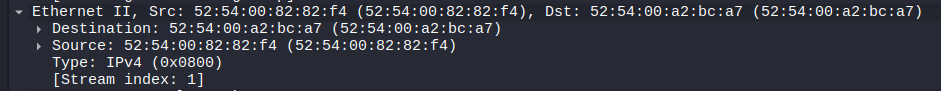
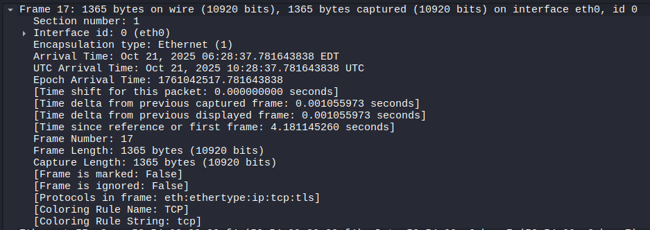

# h0
Tehtävänanto: tunnilla. Terokarvinen.com

Testasin tässä ensin `tshark`:ia yksinkertaisemmalla kutsulla, sitten testasin
`wireshark`:lla selaimen kautta verkkosivulle menoa.

Ensin yhdessä terminaalissa avataan `tshark` kuuntelemaan eth0.
```bash
$ tshark -i eth0
```

Sitten haetaan google.com -sivu.
```bash
$ curl google.com
```

tsharkkiin ilmestyy:
```bash
...
# DNS -> application layer
# kali (192.168.122.40) lähettää pyynnön sille määritetylle default gatewaylle, 192.168.122.1. Kyselee kuka on google.com
# ja vastauksena tulee DNS palvelimelta IP osoite

3 3.079583271 192.168.122.40 → 192.168.122.1 DNS 70 Standard query 0xb27e A google.com
4 3.079604807 192.168.122.40 → 192.168.122.1 DNS 70 Standard query 0x2c7f AAAA google.com
5 3.387236323 192.168.122.1 → 192.168.122.40 DNS 86 Standard query response 0xb27e A google.com A 216.58.210.142
6 3.387304360 192.168.122.1 → 192.168.122.40 DNS 98 Standard query response 0x2c7f AAAA google.com AAAA 2a00:1450:4026:805::200e

# TCP -> transport layer
# Näkyy SYN, SYN/ACK, ACK, yhteydenmuodostus
7 3.388199791 192.168.122.40 → 216.58.210.142 TCP 74 58400 → 80 [SYN] Seq=0 Win=64240 Len=0 MSS=1460 SACK_PERM TSval=119296219 TSecr=0 WS=128
8 3.450489555 216.58.210.142 → 192.168.122.40 TCP 74 80 → 58400 [SYN, ACK] Seq=0 Ack=1 Win=65535 Len=0 MSS=1400 SACK_PERM TSval=209094382 TSecr=119296219 WS=256
9 3.450619880 192.168.122.40 → 216.58.210.142 TCP 66 58400 → 80 [ACK] Seq=1 Ack=1 Win=64256 Len=0 TSval=119296282 TSecr=209094382

# HTTP -> application layer
# GET pyyntö lähetetään
10 3.450955570 192.168.122.40 → 216.58.210.142 HTTP 140 GET / HTTP/1.1

# TCP -> transport layer
# ACK, google.comin IP osoite sai pyynnön vastaan
11 3.576696298 216.58.210.142 → 192.168.122.40 TCP 66 80 → 58400 [ACK] Seq=1 Ack=75 Win=268800 Len=0 TSval=209094412 TSecr=119296282

# HTTP -> application layer
12 3.625940432 216.58.210.142 → 192.168.122.40 HTTP 839 HTTP/1.1 301 Moved Permanently  (text/html)

# TCP -> transport layer
13 3.626006296 192.168.122.40 → 216.58.210.142 TCP 66 58400 → 80 [ACK] Seq=75 Ack=774 Win=63488 Len=0 TSval=119296457 TSecr=209094549
14 3.626379008 192.168.122.40 → 216.58.210.142 TCP 66 58400 → 80 [FIN, ACK] Seq=75 Ack=774 Win=63488 Len=0 TSval=119296457 TSecr=209094549
15 3.660127347 216.58.210.142 → 192.168.122.40 TCP 66 80 → 58400 [FIN, ACK] Seq=774 Ack=76 Win=268800 Len=0 TSval=209094597 TSecr=119296457
16 3.660180743 192.168.122.40 → 216.58.210.142 TCP 66 58400 → 80 [ACK] Seq=76 Ack=775 Win=63488 Len=0 TSval=119296491 TSecr=209094597
...
```

Vastaavasti ihan verkkosivulle meno esim Mozzillassa. Tarvitaan jo wireshark, koska dataa tulee paljon
```bash
$ wireshark
# Tämän jälkeen selaimessa auki terokarvinen.com
```
Otan tarkastelun alle TLS:lle kuuluvan Client Hello:n. Tämä on aiheellista, koska
lueskelin vasta äskettäin artikkelia CloudFlaren ECH:sta (Encrypted Client Hello)[^1].



Aloitetaan tarkastelu application layeriltä eli TLS kättelystä tässä tapauksessa.
Tässä ei siis vaadittu muuta, kuin eri layerien erottelu kuviin.



Huomaa myös, että `terokarvinen.com`:lle on myös lähetetty ECH, mutta tästä ei
selviä tehdäänkö asialle mitään.

Application layerin tietoihin liitetään seuraavaksi transport layerin tiedot.
Nyt transport layer hoitaa portit ja muut tiedot, esim. sekvenssinumerot, ackit
ja datan pituuden



Sitten pakataan Internet layerille. IP layer hoitaa IP-osoitteet paketille



Link layer hoitaa MAC osoitteet



.. ja pakkaa kaiken frameen



# Viittaukset
[^1]: Encrypted Client Hello - the last puzzle piece to privacy, Achiel van der Mandele, Alessandro Ghedini, Christopher Wood, Rushil Mehra, 2023-09-29, https://blog.cloudflare.com/announcing-encrypted-client-hello/
