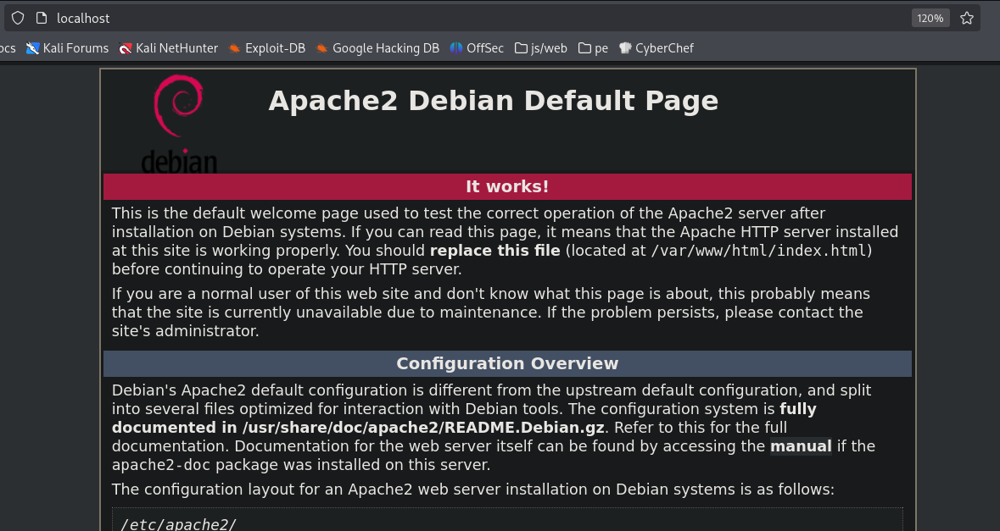
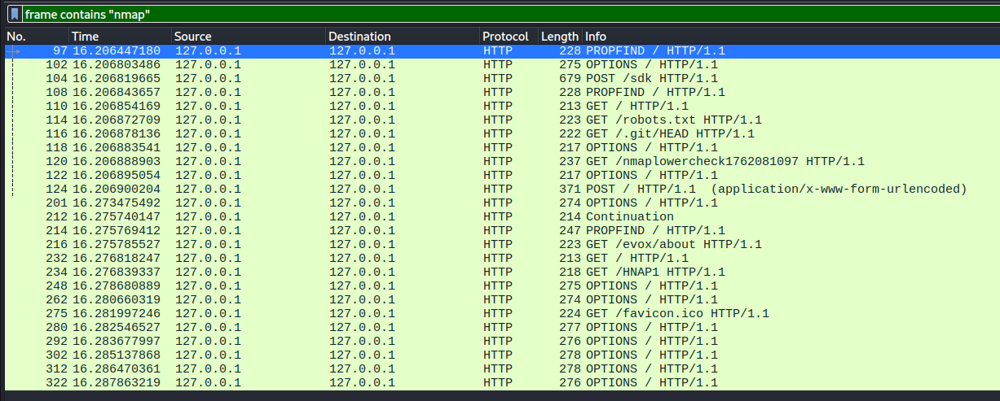
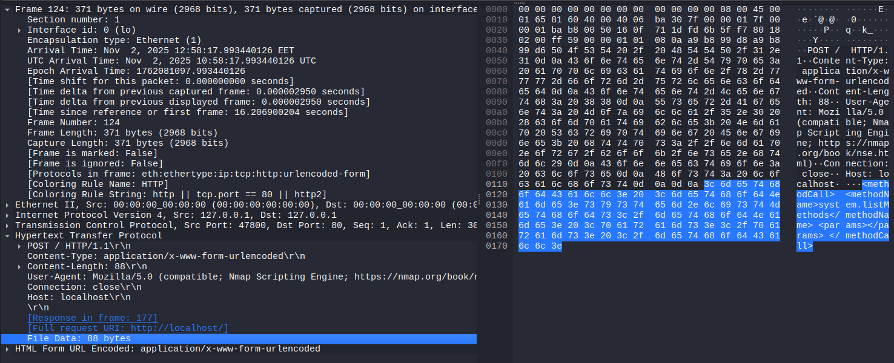
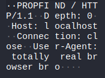
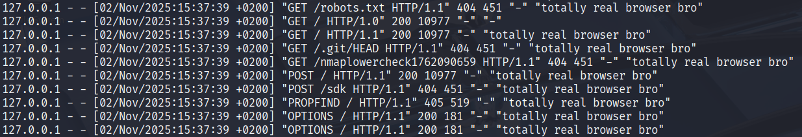
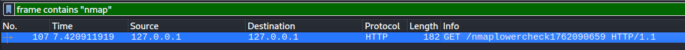
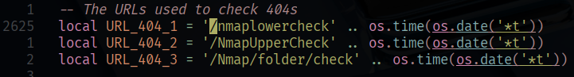
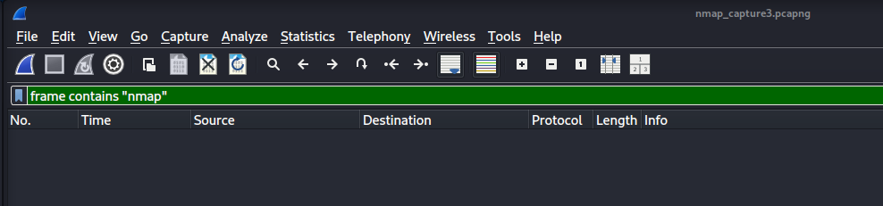

# H2
Tehtävänanto: Tero Karvinen, Lari Iso-Anttila, https://terokarvinen.com/verkkoon-tunkeutuminen-ja-tiedustelu/

***
## Tehtävä x
> x) Lue/katso/kuuntele ja tiivistä.
    > - Selitä tuskan pyramidin idea 1-2 virkkeellä.
    > - Selitä timanttimallin (Diamond Model) idea 1-2 virkkeellä. Tekijä esittelee sen aika juhlallisesti, voit myös etsiä yksinkertaisempia artikkeleita hakukoneella tai kelata suoraan timantin kuvaan.

- [Bianco 2013: Pyramid of Pain.](https://detect-respond.blogspot.com/2013/03/the-pyramid-of-pain.html)
    - Pyramid of pain kuvastaa eri indikaattoreita sille, kuinka helppo hyökkääjän
    on välttää tietynlaisia estoja, joita heidän tielleen laitetaan puolustusta
    varten. Esimerkkinä oli IP-osoitteet. Ne ovat melko matalalla "kipu"-tasolla,
    koska nämä on helppo muuttaa joksikin muuksi, jos huomataan, että tälläinen
    on estetty. Suurimpina kipu-tasolla olivat TTP (tactics, techniques & procedures),
    jossa tunkeutumista vaikeuttaa huomattavasti, jos hyökkääjän aikeet voidaan
    havaita riittävän nopeasti. Tässä käytettiin esimerkkinä Pass-the-Hash:n
    havaitsemista. Jos tämä havaitaan ja estetään, hyökkääjä joutuu keksimään uuden
    keinon jatkaa, joka vie paljon aikaa.

- [Caltagirone et al 2013: Diamond Model](https://www.threatintel.academy/wp-content/uploads/2020/07/diamond-model.pdf)
    - Timanttimallissa on 4 ominaisuutta, joille on muodostettu yhteys toisiinsa,
    jota hyödynnetään tunkeutumisen analyysissä: Adversary, Infrastructure, Capability, Victim.
    Ominaisuudet on yhdistetty toisiinsa timantin kulmista, jossa reunat yhdistävät
    ominaisuudet keskenään yhteen.
    - Adversary <-> Capability: näyttää yhteyden, jossa hyökkääjä rakentaa tai käyttää
    työkalujaan hyökkäämiseen/tiedusteluun
    - Capability <-> Infrastructure: työkaluja käytetään infran hyökkäämiseen/tiedustelemiseen
    - Infrastructure <-> Victim: infraa käytetään kohteen saavuttamiseksi

***
## Tehtävä a
> a) Apache log. Asenna Apache-weppipalvelin paikalliselle virtuaalikoneellesi. Surffaa palvelimellesi salaamattomalla HTTP-yhteydellä, http://localhost . Etsi omaa sivulataustasi vastaava lokirivi. Analysoi yksi tällainen lokirivi, eli selitä sen kaikki kohdat.

Asennetaan apache2 ja laitetaan se päälle
```bash
$ sudo apt install apache2
apache2 is already the newest version (2.4.65-3+b1).
apache2 set to manually installed.
Summary:
  Upgrading: 0, Installing: 0, Removing: 0, Not Upgrading: 0

$ sudo systemctl start apache2.service
```

Vieraillaan sivulla selaimen kanssa



```bash
$ tail /var/log/apache2/access.log
127.0.0.1 - - [02/Nov/2025:11:39:23 +0200] "GET / HTTP/1.1" 200 3383 "-" "Mozilla/5.0 (X11; Linux x86_64; rv:128.0) Gecko/20100101 Firefox/128.0"
127.0.0.1 - - [02/Nov/2025:11:39:23 +0200] "GET /icons/openlogo-75.png HTTP/1.1" 200 6040 "http://localhost/" "Mozilla/5.0 (X11; Linux x86_64; rv:128.0) Gecko/20100101 Firefox/128.0"
127.0.0.1 - - [02/Nov/2025:11:39:23 +0200] "GET /favicon.ico HTTP/1.1" 404 487 "http://localhost/" "Mozilla/5.0 (X11; Linux x86_64; rv:128.0) Gecko/20100101 Firefox/128.0"
```

Tarkastellaan ensimmäistä riviä: selain lähettää GET pyynnön HTTP versiolla 1.1
jossa selain haluaa tämän osoitteen juurihakemiston / .

Tähän apache-palvelin vastaa 200OK ja palveltavan juurihakemiston sisällön koon.
Rivillä näkyy myös selaimen user-agent lopuksi.

Sisällön koon ja user-agentin välissä oleva "-" on referer, eli mistä sivulta
ollaan tultu hakemaan tätä sisältöä. Se on tyhjä, kun sisältöä haetaan kirjoittamalla
URL suoraan kenttään.

***
## Tehtävä b, c ja d
> b) Nmapped. Porttiskannaa oma weppipalvelimesi käyttäen localhost-osoitetta ja 'nmap -A' päällä. Selitä tulokset. (Pelkkä http-portti 80/tcp riittää)

> c) Skriptit. Mitkä skriptit olivat automaattisesti päällä, kun käytit "-A" parametria? (Näkyy avoimien porttinumeroiden alta, http-blah, http-blöh...).

> d) Jäljet lokissa. Etsi weppipalvelimen lokeista jäljet porttiskannauksesta (NSE eli Nmap Scripting Engine -skripteistä skannauksessa). Löydätkö sanan "nmap" isolla tai pienellä? Selitä osumat. Millaisilla hauilla tai säännöillä voisit tunnistaa porttiskannauksen jostain muusta lokista, jos se on niin laaja, että et pysty lukemaan itse kaikkia rivejä?

Nmapin man-sivuilta[^1] pystyy lukemaan käytännössä kaiken näihin tehtäviin liittyvää.
Toinen hyvä resurssi nmapille on myös niiden omat sivut[^2]. Sieltä löytyy paljon
vaativampaakin materiaalia esim. tulimuurien välttelyyn

Tarkastellaan liput:
- -A asettaa tietyt liput käyttöön[^1]:
    - OS detection (-O): yrittää tunnistaa koneella olevan käyttöjärjestelmän
    - version scanning (-sV): yrittää tunnistaa portin takana kuuntelevan palvelun version
    - script scanning (-sC): tunnistaa ja yrittää tiedustella enemmän porttien takana olevien palvelujen tilasta ja haavoittuvuuksista
    - traceroute (--traceroute): yrittää näyttää pakettien reitin alusta loppuun kaikkine hyppyineen reitittimien ja kytkinten välillä

Seuraavalla komennolla voi nähdä kaikki scriptit jota sC voi ajaa. ilman rg:tä saa enemmän tietoa vielä
```bash
$ nmap --script-help default | rg "Categories" -C 1
```

Näitä kaikkia scriptejä ei siis ajeta joka kerta. Vain jos jokin palvelu on
tunnistettu portin takaa, niin siihen liittyvät scriptit ajetaan[^1]

Aloitetaan skannaus:

```bash
$ nmap -p 80 -A 127.0.0.1
...
PORT   STATE SERVICE VERSION
80/tcp open  http    Apache httpd 2.4.65 ((Debian))
|_http-title: Apache2 Debian Default Page: It works
|_http-server-header: Apache/2.4.65 (Debian)
```

Löytyi avoin portti, 80, joka on tunnistettavissa yleensä http portiksi,
sen takana kuuntelee apache demoni versio 2.4.65, lisäksi tunnistettu Debian pohjaiseksi.

Scripteillä (`http-title, http-server-header`) luettu apachen tarjoiltavan sivun otsikko
ja apachen tarjoiltava palvelimen otsake

`http-title`:n scriptiä voi tarkastella tarkemmin:

```bash
$ nmap --script-help http-title
Starting Nmap 7.95 ( https://nmap.org ) at 2025-11-02 12:33 EET
http-title
Categories: default discovery safe
https://nmap.org/nsedoc/scripts/http-title.html
Shows the title of the default page of a web server.
The script will follow up to 5 HTTP redirects, using the default rules in the
http library.
```

ja samoin `http-server-header`:

```bash
$ nmap --script-help http-server-header
Starting Nmap 7.95 ( https://nmap.org ) at 2025-11-02 12:34 EET
http-server-header
Categories: version
https://nmap.org/nsedoc/scripts/http-server-header.html
Uses the HTTP Server header for missing version info. This is currently
infeasible with version probes because of the need to match non-HTTP services
correctly.
```

OS tunnistamisesta löytyy kokonainen alaosio man-sivuilla[^1]. Käytännössä kuitenkin
tunnistaminen tapahtuu, koska eri käyttöjärjestelmät vastaavat TCP ja UDP paketteihin
hieman erilailla. Tästä johtuen käyttöjärjestelmät voidaan myös fingerprinttaa.

Porttiskannauskomennon analysointia jatkaen:

```bash
Warning: OSScan results may be unreliable because we could not find at least 1 open and 1 closed port
Device type: general purpose
```

Yllä olevan varoituksen vuoksi nmap "arvaa" (fuzzy) mikä käyttöjärjestelmä olisi käytössä

Käyttöjärjestelmäksi arvataan Linux väliltä 2.6.32 - 6.2:
```bash
Running: Linux 2.6.X|5.X
OS CPE: cpe:/o:linux:linux_kernel:2.6.32 cpe:/o:linux:linux_kernel:5 cpe:/o:linux:linux_kernel:6
OS details: Linux 2.6.32, Linux 5.0 - 6.2
```

Traceroute näyttää 0 hyppyä, koska skannattiin paikallista palvelinta:
```bash
Network Distance: 0 hops
```

Tuossa näkyy tulokset nmap skannauksesta apache lokissa.

Sana nmap näkyy "nmap" ja "Nmap" muodossa user-agent osassa useasti. Yksi GET-pyyntö näyttää myös sisältävän "nmap" sanan.

Samalla myös haku/sääntö jolla voidaan tunnistaa porttiskannaus lokista ainakin tässä tapauksessa
(huom. `rg`:n `-i` lippu on "case insensitive" hakua varten):
```bash
$ tail -n 100 /var/log/apache2/access.log | rg -i "nmap"
"PROPFIND / HTTP/1.1" 405 519 "-" "Mozilla/5.0 (compatible; Nmap Scripting Engine; https://nmap.org/book/nse.html)"
"PROPFIND / HTTP/1.1" 405 519 "-" "Mozilla/5.0 (compatible; Nmap Scripting Engine; https://nmap.org/book/nse.html)"
"GET / HTTP/1.1" 200 10977 "-" "Mozilla/5.0 (compatible; Nmap Scripting Engine; https://nmap.org/book/nse.html)"
...
"GET /nmaplowercheck1762077245 HTTP/1.1" 404 451 "-" "Mozilla/5.0 (compatible; Nmap Scripting Engine; https://nmap.org/book/nse.html)"
...
"OPTIONS / HTTP/1.1" 200 181 "-" "Mozilla/5.0 (compatible; Nmap Scripting Engine; https://nmap.org/book/nse.html)"
```

***
## Tehtävä e
> e) Wire sharking. Sieppaa verkkoliikenne porttiskannatessa Wiresharkilla. Huomaa, että localhost käyttää "Loopback adapter" eli "lo". Tallenna pcap. Etsi kohdat, joilla on sana "nmap" ja kommentoi niitä. Jokaisen paketin jokaista kohtaa ei tarvitse analysoida, yleisempi tarkastelu riittää.

Laitetaan wiresharkilla kuuntelu käyntiin loopbackiin, sitten ajetaan sama nmap
kuin aikaisemminkin on ajettu.

`frame contains "nmap"` filtterillä nähdään kaikki framet, jotka sisältää sanan "nmap" (case insensitive)



Wireshark näyttää paketit siinä järjestyksessä kuin ne ovat lähteneet. Apachen access logiin
verrattuna huomataan vähän eroavaisuuksia siinä, mitkä asiat tulevat esiin muita ennen

Tarkastellaan parit löytyvät scriptit jotka tekevät POSTeja:

Paketti 104 on POST /sdk, jossa näytetään lähetettävän jotain xml:ää payloadina palvelimelle


Paketti 124 on POST /, jossa lähetetään jokin "methodCall system.listMethods" palvelimelle



***
## Tehtävä f
> f) Net grep. Sieppaa verkkoliikenne 'ngrep' komennolla ja näytä kohdat, joissa on sana "nmap".

Tutkitaan taas lippuja ngrepin man-sivuja lukemalla[^3].
- -I -> input pcap file
- -i -> insensitive case
- -C -> colorized, helpompi nähdä

```bash
$ ngrep -I nmap_capture.pcapng -i "nmap" -C
input: nmap_capture.pcapng
filter: ((ip || ip6) || (vlan && (ip || ip6)))
match (JIT): nmap
###
T 127.0.0.1:47686 -> 127.0.0.1:80 [AP] #97
  PROPFIND / HTTP/1.1..Connection: close..Host: localhost..User-Agent: Mozilla/5.0 (compatible; Nmap Scripting Engine; https://nmap.org/book/nse.html)..Depth: 0....
###
T 127.0.0.1:47690 -> 127.0.0.1:80 [AP] #102
  OPTIONS / HTTP/1.1..Origin: example.com..User-Agent: Mozilla/5.0 (compatible; Nmap Scripting Engine; https://nmap.org/book/nse.html)..Connection: close..Access-Cont
  rol-Request-Method: HEAD..Host: localhost....
###
...
```

Näitä oli lukuisia muitakin, lukee User-Agent kohdissa.

***
## Tehtävä g ja h
> g) Agentti. Vaihda nmap:n user-agent niin, että se näyttää tavalliselta weppiselaimelta.

User agent voidaan muuttaa asettamalla script argumenteiksi seuraavasti
```bash
$ nmap -p 80 -A 127.0.0.1 --script-args='http.useragent=totally real browser bro'
...
```

> h) Pienemmät jäljet. Porttiskannaa weppipalvelimesi uudelleen localhost-osoitteella. Tarkastele sekä Apachen lokia että siepattua verkkoliikennettä. Mikä on muuttunut, kun vaihdoit user-agent:n? Löytyykö lokista edelleen tekstijono "nmap"?

Nyt tarkastellessa jotain framea, joka sisältää nmapin user-agentin



Ja apache-lokissa:



Mutta edelleen näkyy yksi frame, jossa näkyy teksti "nmap"



***
## Tehtävä i
> i) Hieman vaikeampi: LoWeR ChEcK. Poista skritiskannauksesta viimeinenkin "nmap" -teksti. Etsi löytämääsi tekstiä /usr/share/nmap -hakemistosta ja korvaa se toisella. Tee porttiskannaus ja tarkista, että "nmap" ei näy isolla eikä pienellä kirjoitettuna Apachen lokissa eikä siepatussa verkkoliikenteessä. (Tässä tehtävässä voit muokata suoraan lua-skriptejä /usr/share/nmap alta, 'sudoedit'. Muokatun version paketoiminen siis rajataan ulos tehtävästä.)

Etsimällä nmapin tiedostoja läpi, löytyy syyllinen:
```bash
$ rg -i "nmaplowercheck" /usr/share/nmap/
/usr/share/nmap/nselib/http.lua
2625:  local URL_404_1 = '/nmaplowercheck' .. os.time(os.date('*t'))
```
Mennään katselemaan suoraan tekstieditorilla tätä tiedostoa



Vaihdetaan kaikki nämä kolme ainakin nmap -> apt


Ajetaan uudelleen ja kaapataan wiresharkilla
```bash
$ nmap -p 80 -A 127.0.0.1 --script-args='http.useragent=totally real browser bro'
...
```



Enää ei näy "nmap" missään

# Viittaukset
[^1]: nmap(1) - Linux man page, https://linux.die.net/man/1/nmap
[^2]: Nmap Network Scanning: The Official Nmap Project Guide to Network Discovery and Security Scanning, Gordon “Fyodor” Lyon, https://nmap.org/book/toc.html
[^3]: ngrep(8) - Linux man page, https://linux.die.net/man/8/ngrep
