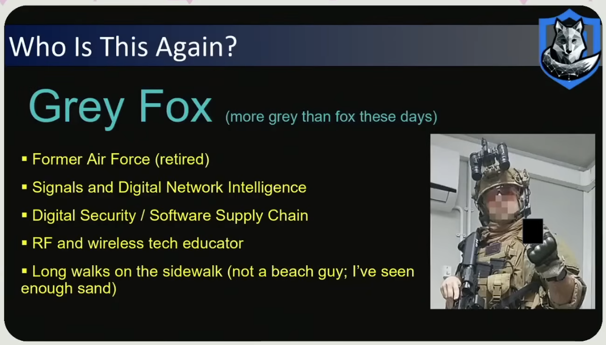
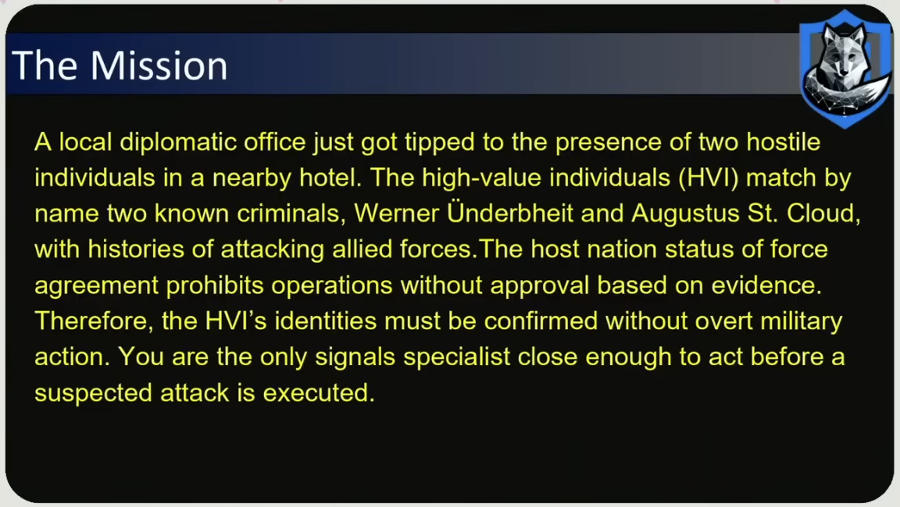
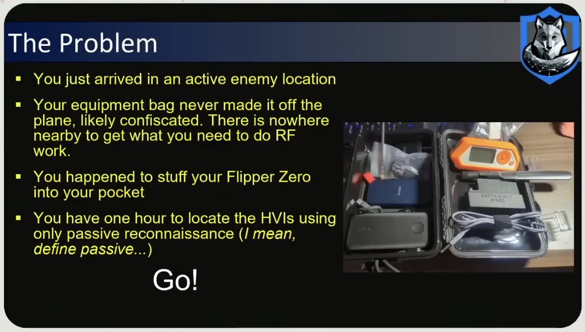
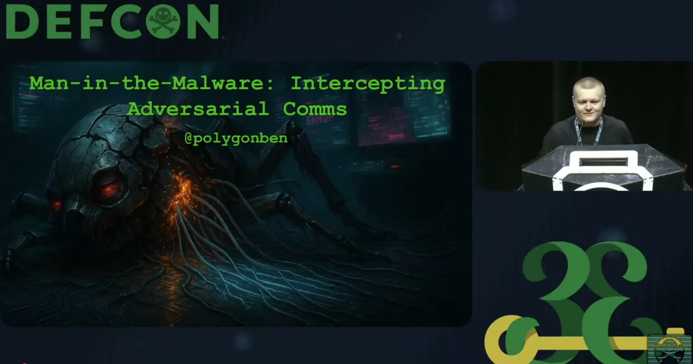
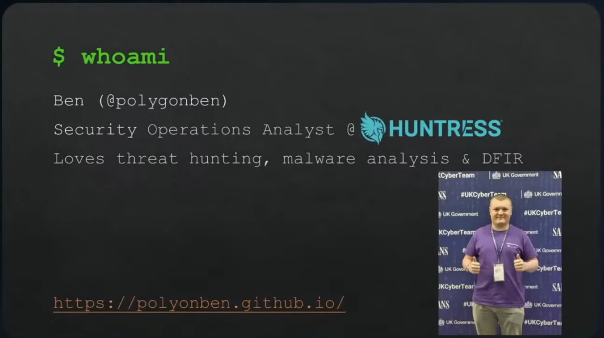
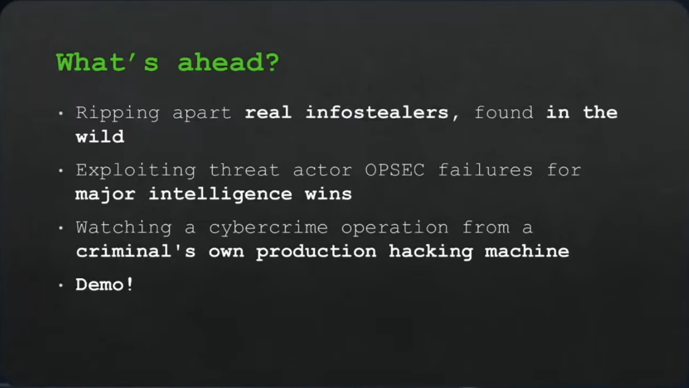
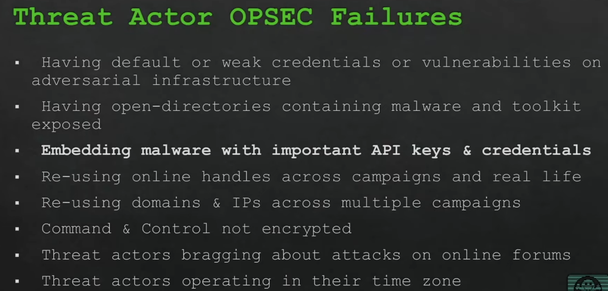
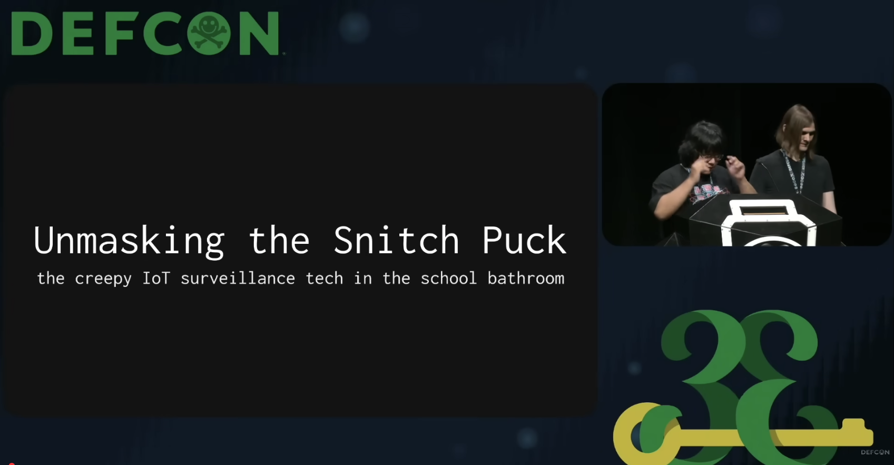
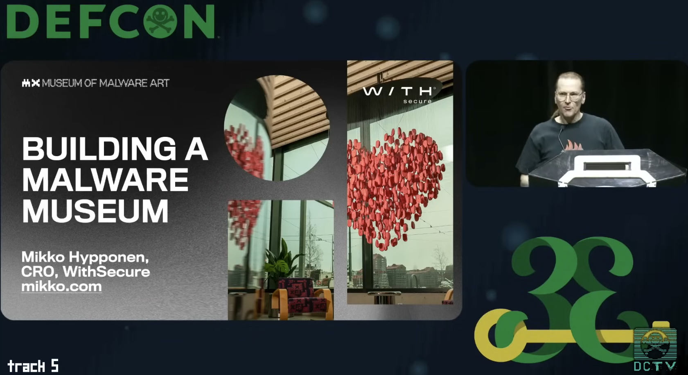

# h3 Messuilla
Tehtävänanto: Tero Karvinen, Lari Iso-Anttila, https://terokarvinen.com/verkkoon-tunkeutuminen-ja-tiedustelu/
> Osallistu Cyber Security Nordic -tapahtumaan.

> x) Läksyksi tästä tapahtumasta teidän tulee tehdä lyhyt raportti siitä, mitä yrityksiä tapasitte,
mitä mielenkiintoisia palveluita / tuotteita (max 3kpl) löysitte.

> Suosittelen osallistumaan messuille. Mikäli et missään tapauksessa halua osallistua messuille,
voit vaihtoehtotehtävänä laatia tiivistelmän täyspitkästä hakkeritapahtuman esityksestä verkosta
löytämästäsi videosta (esim. Disobey, Black Hat...).

En päässyt osallistumaan valitettavasti messuille, joten mennään vaihtoehtotehtävällä.

Olen jo useamman kuukauden ajan kuunnellut esityksiä DEF CON 31-33:sta esim. kävelyillä.
Näistä tuli mieleen ainakin 5 videota, jotka voin esitellä tässä. Ne ovat tähän
mennessä olleet lemppareitani.

Päätin ottaa n. 5 esityksen verran videoita,
koska tämä varmaan vastaisi jotakuinkin kokonaista päivää tapahtumassa olettaen, että
esitykset tapahtuisivat tasatunnein ja välissä olisi ruokatunti.

Jätän näistä kaikista esityksistä mielummin spoilaamatta mitä on tehty ja esittelen
vain siltä kannalta, mitä voi päästä näkemään katsomalla videon, johon on linkattu.

Ensimmäisenä kurssin aiheisiin eniten liittyy DEF CON 33 RF villagessa ollut esitys,
jossa Grey Fox nimellä kulkeva henkilö esitteli, kuinka Flipper Zerolla voisi
harrastaa passiivista tiedustelua.

Source: [DEF CON 33 - RF Village - Tactical Flipper Zero You Have 1 Hour and No Other Equipment - Grey Fox](https://www.youtube.com/watch?v=b8-uDKkfw5c)

Kyseessä siis on esitys, jossa demotaan tilannetta, missä tehtävänä on löytää pari
"tunnettua" rikollista. Työn tekemiseen liittyvät tavarat ovat jääneet lentokentälle
jumiin, mutta onneksi Flipper Zero on ollut taskussa mukana aina.

Esityksessä käydään läpi useita tapoja paikantaa näitä, ketä ollaan etsimässä
käyttämällä ainoastaan Flipperiä. Tästä saa jo mielestäni hyvän "teaserin", jotta
haluaisi käydä kuuntelemassa koko jutun.

---
---
---

Seuraavana aihe, joka liittyisi enemmän sovellusten hakkerointiin.

Source: [DEFCON33 - Man-In-The-Malware: Intercepting Adversarial Communications](https://www.youtube.com/watch?v=58jT-uCLJzI)

Esityskessä käytiin läpi tilannetta, jossa esittäjä oli löytänyt infostealerin,
jota hän alkoi ryhmänsä kanssa käänteismallintamaan.

Käänteismallintaessa he huomasivat useita epäonnistumisia haittaohjelmassa, mm. vapaasti luettavia API-avaimia
jotka antoivat heille pääsyn suoraan hyökkääjän Telegram bottiin, josta he saivat
lisätietoja hyökkääjästä, esimerkiksi kuvakaappauksia heidän näytöltään haittaohjelmaa
rakentaessa, jota kautta he löysivät mm. hyökkääjän aliaksen. Tätä kautta he löysivät
myös saman hyökkääjän kirjoittelemassa julkisilla foorumeilla muista asioista.

---
---
---

Seuraavaksi aiheena tarinoita Tor-verkon kehittäjältä. Roger 'arma' Dingledine
ei valitettavasti antanut mitään slideja, joten video on pelkästään kuvaa hänestä
puhumassa lavalla.

Esityksessä käydään läpi vuosien saatossa olleita haasteita Tor-verkon kanssa.
Siitä, kuinka Roger on käynyt useaan otteeseen opettamassa NSA:ssa ja FBI:ssä
sitä, miksi yksityisyys on tärkeää ja miksi Tor-verkkoon ei voida nyt eikä myöhemminkään
asennuttaa heille takaovia.

Roger puhuu myös siitä, kun Iran joskus onnistui estämään Torin, ja siitä kuinka
se lopulta keksittiin mitä kautta he tämän onnistuivat estämään. Samalla myös hän
selittää, kuinka Venäjä yrittäessään estää Toria, päätyi estämään koko Microsoft
Azuren palvelut vahingossa sen sijaan.

Hyvin mielenkiintoista kuunneltavaa, varsinkin cyberistä kiinnostuneille!

Source: [DEF CON 33 - Stories from a Tor dev - Roger 'arma' Dingledine](https://www.youtube.com/watch?v=djM70O0SnsY)

---
---
---

Source: [DEF CON 33 - Unmasking the Snitch Puck: IoT surveillance tech in the school bathroom - Reynaldo, nyx](https://www.youtube.com/watch?v=WCnojaEpF2I)

Seuraavassa esityksessä Reynaldo ja nyx tutkivat koulussa vastaan tullutta "snitch puck":ia,
joka näytti olevan eräänlainen IoT "palohälytin", joka tunnisti kaikkea muutakin,
esim. vape höyryä ja ääntä. Reynaldo oli koulussa ollessaan (15-vuotiaana!) löytänyt näitä
laitteita suorittamalla ARP-skannauksen koulun WiFissä. Hän oli ajan vietteeksi
ostanut tämänlaisen laitteen netistä ja korkannut sen, jota kautta huomasi, että
saisi aika helposti korkattua myös koulussa olevat vastaavat laitteet. Totesi tämän
aika huonoksi asiaksi, että laitteita pystyi korkkaamaan niin helposti.

---
---
---

Source: [DEF CON 33 (2025) - Mikko Hypponen - Building a Malware Museum](https://www.youtube.com/watch?v=6eC_wV5Nztc)

Ja viimeisenä vuorossa Mikko Hyppösen esitys omasta urahistoriastaan. Hän esitteli
vanhoja haittaohjelmia, jotka hän luokitteli taiteeksi. Samalla hän puhui tulevasta
Museum of Malware Art, joka löytyy nyt jo WithSecuren tiloista Jätkäsaaresta!

Samalla Mikko ilmoitti lopettavansa työt haittaohjelmien parissa siirtyessään
droneturvallisuuden pariin, jossa kokee kykenevänsä vaikuttamaan positiivisesti.

