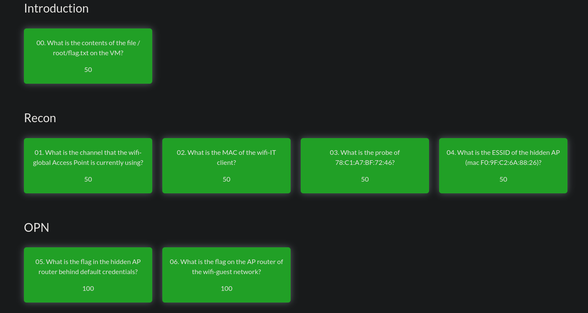

# H6
Tehtävänanto: https://terokarvinen.com/verkkoon-tunkeutuminen-ja-tiedustelu/

Asensin Wifi challenge labin dockerin kautta Kaliin. Asennus tapahtui *melkein*
suoraan seuraamalla heidän ohjeitaan:
```bash
$ git clone https://github.com/r4ulcl/WiFiChallengeLab-docker
$ cd WiFiChallengeLab-docker
```
Ja tähän loppui heidän osuus, loput olikin testailemalla selvitelty

Asennetaan virtuaaliset interfacet
```bash
$ cd APs/mac80211_hwsim
$ sudo ./install.sh
```

Tämän jälkeen asetin vielä docker-compose.yml konfiguraatioon loppuihin
kontteihin myös resurssirajat, koska huomasin, että kahdella resurssilla ei ollut
rajoja

```yaml
clients:
...
  deploy:
    resources:
      limits:
        cpus: "2.0"
          memory: 2G
        reservations:
          memory: 512M

aps:
...
  deploy:
    resources:
      limits:
        cpus: "2.0"
          memory: 2G
        reservations:
          memory: 512M

```

Tämän jälkeen takaisin WiFiChallengeLab-docker-kansioon ja:
```bash
$ docker compose up -d

# n. minuutin päästä
$ docker compose ps
...
# toivotaan, että kaikki kontit ovat "healthy"
```

Huomasin, että minulla ainakin postgres kontti oli rikki. Asiaa enemmän tutkinut
ja seuraavilla komennoilla sen sai toimimaan. Tämä kannattaa tehdä vain, jos kontti on
rikki. Tässä data-kansiossa näyttää olevan nzyme konfiguraatioita. Tämän poisto
ei ainakaan itselleni näyttänyt vaikuttavan muuten mitään, joten ei ollut omalta
osalta menetettävää.

```bash
$ docker compose down
$ sudo rm -rf nzyme/nzyme-logs/data
$ mkdir -p nzyme/nzyme-logs/data
$ docker compose up -d
```

Ja nyt itsellä kaikki skulaa. Voikin aloittaa labran.

WiFiChallengeLab erikseen mainitsee aika useassa paikassa, että heidän tehtävien
ratkaisuja **ei saa** jakaa jukisesti netissä, joten kaikki selostukset tehtävien
teosta jää tällä kertaa pois. Vastaillaan vain meidän tehtävänannon kysymyksiin
vähän enemmän vältellen labran tehtävien vastauksien antamista.

## a)
> a) Tutustu wifi challenge lab 2.1 harjoitus ympäristöön ja käytä tarvittaessa hyväksesi jo olemassa olevia ohjeita.

Kerkesin tekemään `Legacy` alkuun asti tehtäviä.



## b)
> b) Kirjoita raportti siitä mitä opit ja mitkä asia yllättivät sinut kun tutustuit harjoitukseen.

Opin tästä alustakin jo aika paljon. `airodump-ng` -komento oli ensimmäistä kertaa
käytössä. Se oli jo varsin yllättävää mitä kaikkea tällä saa aikaiseksi, esimerkiksi
opin tutkailemaan wifi-signaaleja 2.4GHz ja 5GHz alueelta komennolla:

```bash
$ sudo airodump-ng wlan0 --band abg
```

Josta siis löytyy suoraan `airodump-ng`:n man-sivuilta ohjeet tuohon `--band` lippuun.

Sitten opin muun muassa fuzzaamaan reitittimien piilotettua nimeä. Tähän käytin
`mdk4`-komentoa. Yllättävää tässä oli, että en löytänyt keinoa, jolla voisin käyttää
kaikille tuttua rockyou:ta antamalla lisäsääntöjä. Tämän johdosta jouduin rakentamaan
rockyou:n, jossa lisäsin joka sanan alkuun haluamani "varman" sanan.

`mdk4` hyökkää annetulle MAC-osoitteelle ilmoittamalla tälle haluavansa yhdistää "X"-nimiselle
verkolle. Jos verkko ei ole oikean niminen, reititin ei vastaa, mutta jos nimi on
oikea, niin reititin vastaa. Tätä kautta piilotetun nimen saa selville.

```bash
$ sudo mdk4 wlan0 p -t <MAC> -f /wordlists/wifi-rockyou.txt
```

Opin myös, kuinka virtuaalisesti voidaan yhdistää verkkoon. Itse opin käyttämään
tähän `nmcli` NetworkManageria. Tätä varten pitäisi myös tietää, miten hallinnoida
koneella olevia interfaceja. Esimerkiksi näin saisi näkyviin `wlan3` interfacen
tilan IP-osoitteineen, jos sellainen löytyy.

```bash
$ ip addr show wlan3
124: wlan3: <BROADCAST,MULTICAST,UP,LOWER_UP> mtu 1500 qdisc noqueue state UP group default qlen 1000
    link/ether 02:00:00:00:03:00 brd ff:ff:ff:ff:ff:ff
    inet 192.168.16.46/24 brd 192.168.16.255 scope global dynamic noprefixroute wlan3
       valid_lft 86386sec preferred_lft 86386sec
```

Jos esim. `wlan3` ei ole "state UP", saa sen käyntiin näin

```bash
$ sudo ip link set wlan3 up
# ja näin pois päältä:
$ sudo ip link set wlan3 down
```

Esim. seuraavalla komennolla voi liittyä wifi-verkkoon, jonka nimen tietää
```bash
$ sudo nmcli device wifi connect "wifi-guest" ifname wlan3
# ja näin pois wifistä:
$ sudo nmcli device disconnect wlan3
```

Opin myös deautentikoimaan laitteita wifi-verkosta. Ensin laitetaan interface
tietylle wifin kanavalle

```bash
$ sudo iw dev <interface> set channel 6
```

Sitten `aireplay-ng`:llä deauth.

```bash
$ sudo aireplay-ng --deauth 10 -a <access-point MAC> -c <destination MAC> <interface>
```

Samalla kannattaa asettaa toinen interface kuuntelemaan `airodump-ng`:llä tälle
access-pointille menevää liikennettä ja mieluiten vaikka kirjoittaa sitä `.cap`-tiedostoon,
jotta sitä voi sitten myöhemmin selata Wiresharkilla. Tätä kautta, jos yhteydet
eivät ole salattuja, voidaan suoraan nähdä, kun verkkoon uudelleen kirjautuvat
laitteet lähettävät salaamattomana käyttäjätunnus:salasana -comboja.

Minut vielä yllätti myös luultavasti tämän Dockerin takia johtuvat IPv4-osoitteiden
kanssa ongelmat. Esimerkiksi tehtävä 06 ei toiminut näillä osoitteilla itsellä
ollenkaan. Päädyin tekemään sen niin, että hoidin tehtävän loppuun kontin sisällä,
jossa IPv4-osoitteet toimivat odotetusti. Syynä tässä varmaan on siis dockerin oman
networkin päällekkäisyydet oman mahdollisen networkin kanssa.

## c)
> c) Miten suhtautumisesi WLanin turvallisuuteen muuttui sen jälkeen kun teit harjoitukset?

Julkinen wifi on aina ollut ja tulee olemaankin paha. Ehkä myös yrityksen verkossa
välttelisin wifi-verkkojen nimeämistä ennustettavasti, jos niiden kuuluisi olla
piilossa.
