# H7
Tehtävänanto: Tero Karvinen, Lari Iso-Anttila,
https://terokarvinen.com/verkkoon-tunkeutuminen-ja-tiedustelu/

> x) Lue ja tiivistä.
> 1) Hubacek 2019: Universal Radio Hacker SDR Tutorial on 433 MHz radio plugs
(Video, alkaen 3:19 ja päättyen 7:40. Yhteensä noin 4 min.)
> 2) Cornelius 2022: Decode 433.92 MHz weather station data
> 3) Vapaaehtoinen, vaikeahko: Lohner 2019: Decoding ASK/OOK_PPM Signals with
URH and rtl_433

1) Videolla[^4] tallennettiin lähettimen signaali, joka kopioitiin johonkin omalle
piirilevylle, joka voitiin C:llä ohjelmoida lähettämään sama signaali uudestaan.
Signaali oli kaapattu onnistuneesti ja sitä kokeiltiin vielä omalla piirilevyllä,
joka sai laitteen, joka signaalia odotti, käynnistymään.

Tässä vielä parit notesit URH:in käyttöönotossa:
- Spectrum analyser, RTL-SDR, start, lähetä signaali
- taajuus hieman sivuun suurimmasta piikistä, URH ottaa talteen taajuuden
- record signal, start -> lähetä signaali uudestaan, stop -> save
- Tarkista modulaatio (videolla ASK) -> autodetect parameters
    - bit length "odotetunlainen?". Tämän voi tarkistaa maalaamalla yhden bitin
    ja vertaamaan onko tämän suuruus sama kuin bit length.
    - samalla voi tarkistaa onko kaikki signaalin paketit samanlaisia, jos niiden
    täytyisi olla.
- signal view -> demodulated voi tarkastella vielä tarkemmin

2) Artikkelissa[^5] käytiin melkein samaa asiaa läpi kuin edellisen videon alussa.
Artikkelissa käytiin tarkemmin läpi mitä analyysiä signaalille voidaan tehdä.

## a)
> a) WebSDR. Etäkäytä WebSDR-ohjelmaradiota, joka on kaukana sinusta ja kuuntele
radioliikennettä. Radioliikenne tulee siepata niin, että radiovastaanotin on joko
eri maassa tai vähintään 400 km paikasta, jossa teet tätä tehtävää. Käytä
esimerkkinä julkista, suurelle yleisölle tarkoitettua viestiä, esimerkiksi
yleisradiolähetystä. Kerro löytämäsi taajuus, aallonpituus ja modulaatio. Kuvaile
askeleet ja ota ruutukaappaus. (Tehtävässä ei saa ilmaista sellaisen viestin
sisältöä tai olemassaoloa, joka ei ole tarkoitettu julkiseksi. Voit sen sijaan
kuvailla, miten sait julkisen radiolähetyksen kuulumaan kaiuttimistasi. Julkisten,
esimerkiksi yleisradiolähetysten sisältöä saa tietysti kuvailla.)

Löysin University of Twenteltä verkkosivun WebSDRään[^3].

Kuuntelin vähän ympäriinsä. Mielenkiinnosta katselin enemmän morsettamiseen
liittyviä kanavia. Myöskin huomasin, että oli paljon sellaista liikennettä, joka
on joko salattua tai tahalleen tukittu metelillä.

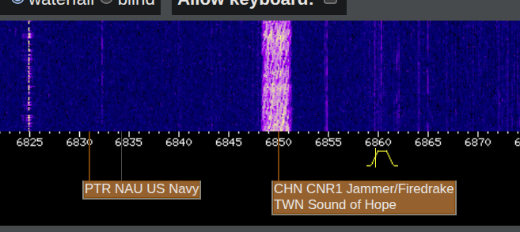

Tässä oli jotain ihan nopeaa ~35 CPM morsetusta, josta en saanut itse selvää

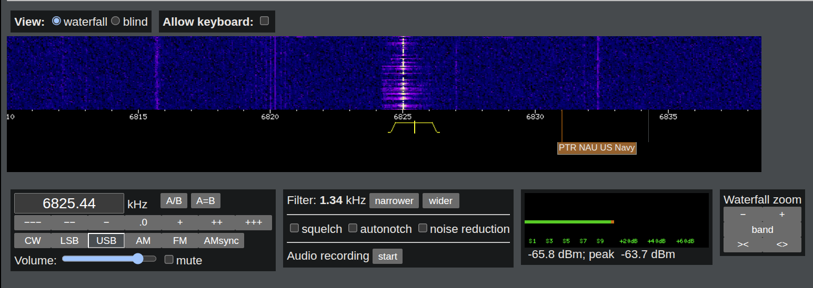

Tämä taas oli selkeää, siinä toistettiin samaa kolmen kirjaimen sarjaa, josta
muodostui kirjaimet "MYN"

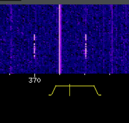

Ja tässä muodostui "BOT"

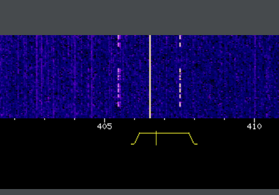

## b)
> b) rtl_433. Asenna rtl_433 automaattista analyysia varten. Kokeile,
että voit ajaa sitä. './rtl_433' vastaa "rtl_433 version 25.02 branch..."

Kalilla asennus onnistui näinkin helposti:
```bash
$ sudo apt install rtl-433
$ sudo apt install rtl-sdr
$ rtl_433
rtl_433 version 25.02 (2025-02-19) inputs file rtl_tcp RTL-SDR SoapySDR
[SDR] No supported devices found.
```

## c)
> c) Automaattinen analyysi. Mitä tässä näytteessä tapahtuu? Mitä tunnisteita
(id yms) löydät? Converted_433.92M_2000k.cs8. Analysoi näyte 'rtl_433' ohjelmalla.


Lueskelemalla man-sivuja[^1][^2] löysin, että `-A`:lla saadaan pulse analysis


Ulos tulee paljon enenmmän tavaraa, jossa analysoidaan pulsseja, niiden leveyttä,
välien leveyttä yms. En ihan näistä vielä ymmärtänyt, mitä tällä tiedolla voidaan
sitten tehdä, mutta ainakin tämä menee jo tiedustelupolkua eteenpäin, kun näytteestä
saadaan enemmän tietoa, kuin mitä siitä oli alunperin.

## d)
> d) Too compex 16? Olet nauhoittanut näytteen 'urh' -ohjelmalla .complex16s
-muodossa. Muunna näyte rtl_433-yhteensopivaan muotoon ja analysoi se. Näyte
Recorded-HackRF-20250411_183354-433_92MHz-2MSps-2MHz.complex16s

Ainakin itsellä tuo näyte toimi ihan hyvin sellaisenaan. Ainut ero mitä tässä on
tuohon ladattavaan versioon, niin muutin sen extensionin `complex16s -> cs16`.
Tästä ext muutoksesta luin myös rtl:n man-sivuilla[^2] "File content and format
are detected ..." :


Ajoin näytteen taas `-A`:lla ja ulos tulee samanlaista kuin edellisessäkin tehtävässä.

## e)
> e) Ultimate. Asenna URH, the Ultimate Radio Hacker.

Asensin URH:n hieman omalla tapaa

Alla olevat pip installit löytyi kokeilemalla ajaa `./main.py`, joka
vuorostaan valitteli aina, että X puuttuu
```bash
$ uv venv
$ source .venv/bin/activate
$ uv pip install numpy cython psutil PyQt5 setuptools
$ git clone https://github.com/jopohl/urh/
$ cd urh/src/urh
$ ./main.py
```

URH käynnistyy, tarvitaan vielä rtl_tcp-palvelin käyntiin, se saadaan ajamalla
toisessa terminaalissa. Sen jälkeen antennilla ja rtl-sdr pömpylällä voi kuunnella
sen vastaanottamia radioaaltoja (tämä testattu toimivaksi edellisellä tunnilla.)

```bash
$ rtl_tcp
No supported devices found.
# joka ei nyt tässä toimi, koska ei ole toimivaa rtl-sdr pömpylää
```

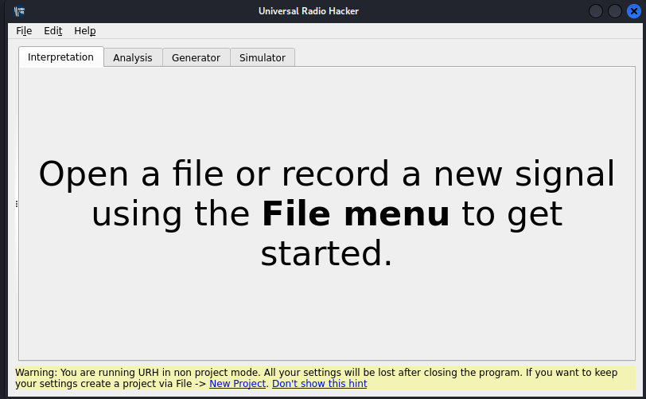

## f)
> f) Yleiskuva. Kuvaile näytettä yleisesti: kuinka pitkä, millä taajuudella,
milloin nauhoitettu? Miltä näyte silmämääräisesti näyttää?
> - Tarkastele näytettä 1-on-on-on-HackRF-20250412_113805-433_912MHz-2MSps-2MHz.complex16s.
Siinä Nexan pistorasian kaukosäätimen valon 1 ON -nappia on painettu kolmesti.
Käytä Ultimate Radio Hacker 'urh' -ohjelmaa.

Avasin näytteen `urh`:lla.

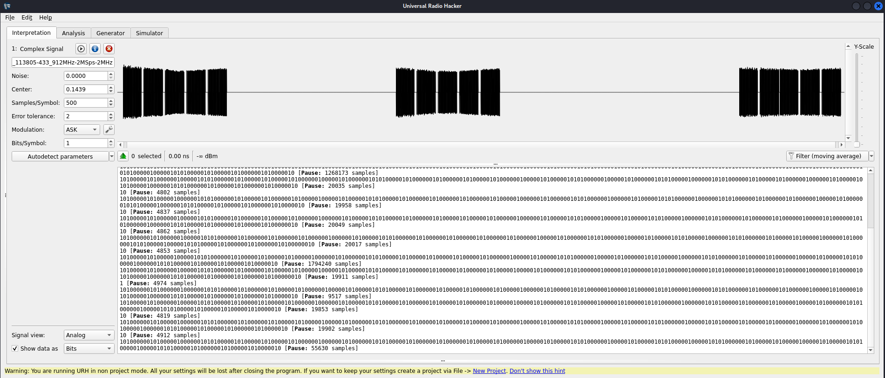

Kun valitaan tuo ikkuna, jossa on bittejä, painetaan Ctrl-A (valitse kaikki),
niin nähdään, että ohjelma samalla valitsee siis tosiaan kaiken datan ja näyttää
sen keston.


Näytteen nimestä pystyy tunnistamaan ainakin kaikki tämän tehtävän kysymykset:

1) Kuinka pitkä? Yllä olevan kuvan perusteella 5.42s
2) Millä taajuudella? 433_912MHz
3) Milloin nauhoitettu? `20250412_113805 -> 2025/04/12 11:38:05`

## g)
> g) Bittistä. Demoduloi signaali niin, että saat raakabittejä. Mikä on oikea
modulaatio? Miten pitkä yksi raakabitti on ajassa? Kuvaile tätä aikaa vertaamalla
sitä johonkin. (Monissa singaaleissa on line encoding, eli lopullisia bittejä varten
näitä "raakabittejä" on vielä käsiteltävä)

Tarkastelin ensin yhden kokonaisen signaalin leveyttä. Kuvasta huomaa, että yhden
kokonaisen signaalin leveys olisi n. 776ms. Huomaan, että tämä yksi signaali sisältää
usean pienemmän signaalin kokonaisuuden.

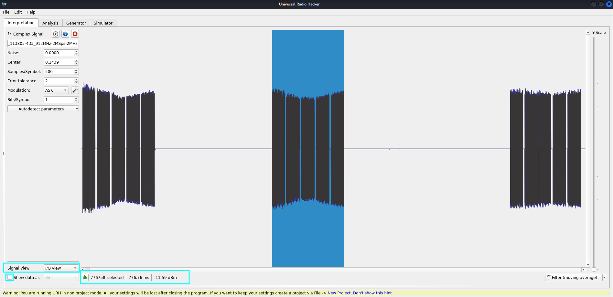

Sen jälkeen vaihdoin signal view: demodulated. Zoomasin vielä paljon enemmän
sisään, jotta saadaan yhden signaalin osan kesto tutkittua. Näyttäisi olevan 134.15ms.

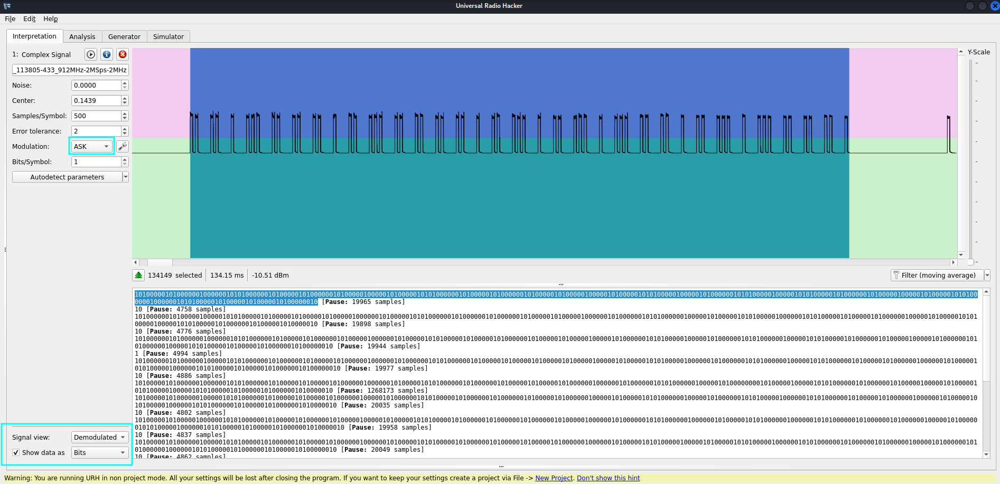

Zoomasin hieman lisää, sitten voidaan alta valita yksi bitti, joka voitaisiin
tässä tulkita siis yhdeksi RF pulssiksi. Valittu pulssi kestää 522us.

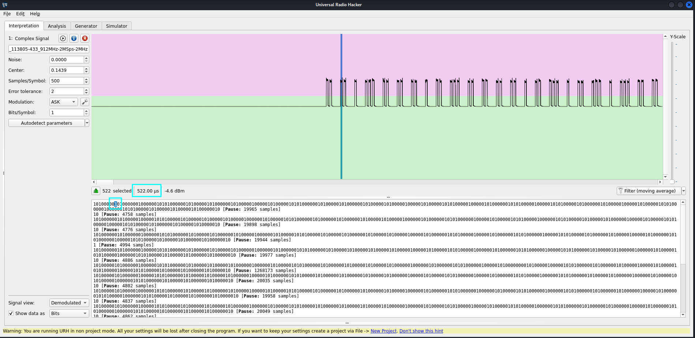

Tätä voi zoomata vielä enemmän ja nähdä miltä oikeassa elämässä "bitti" näyttää.

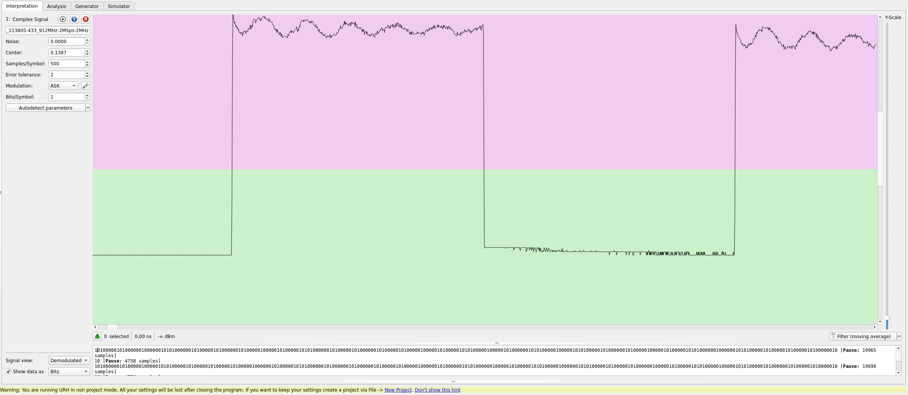

## h)
> h) Vapaaehtoinen: Sdr++. Kokeile sdr++ -sovellusta ja esittele sillä jokin "hei
maailma" -tyyppinen esimerkki.

Asennus kävi näin:

1) Lataa .deb täältä: https://github.com/AlexandreRouma/SDRPlusPlus/releases/tag/nightly
2) Siirsin sen itse tänne ~/Downloads/sdrpp/

Jonka jälkeen:
```bash
$ sudo apt install /home/kali/Downloads/sdrpp/sdrpp_debian_trixie_amd64.deb
$ sdrpp
```

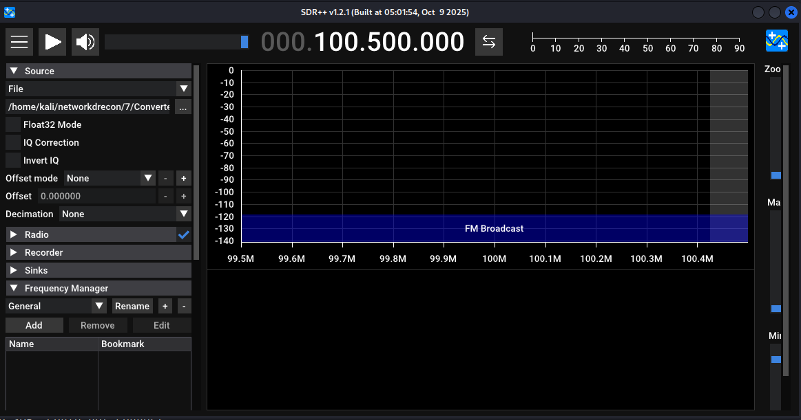

Kokeilin aika monella eri tapaa, mutten saanut tätä ainakaan toimimaan siten, että
sillä saisi näytettyä mitään signaalia esim. valmiista tiedostosta.

## i)
> i) Vapaaehtoinen, vaikeahko: GNU Radio. Asenne GNU Radio ja tee sillä yksinkertainen
"Hei maailma".

Gnuradio oli helpompi verrattuna SDR++:aan. Näillä suoraan asennusapu [täältä](https://wiki.gnuradio.org/index.php/InstallingGR)

```bash
$ sudo apt install gnuradio
```

Ja sitten oman "Hello worldin" tekeminen onnistuu [näiden](https://wiki.gnuradio.org/index.php?title=Your_First_Flowgraph)
ohjeiden avulla.

```bash
$ gnuradio-companion &
```

Seurattuani edellä olevaa lyhyttä ohjetta, sain oman hello worldini toimimaan.
Gnu Radio vaikuttaa vähän monimutkaisemmalta, mutta ainakin tuolla gnuradion omilla
sivuilla oli lukuisia ohjeita aloittamiseen, joka voi olla hyvä lähtökohta niille,
jotka ovat kiinnostuneet näistä radiohommista.

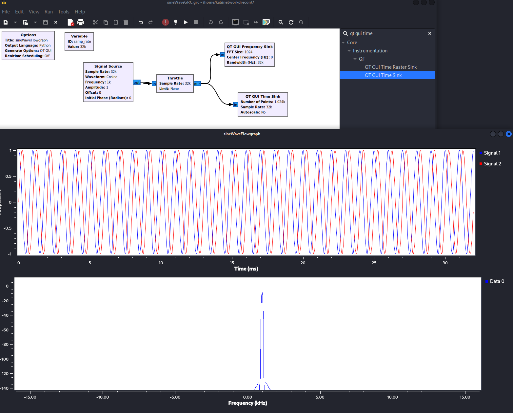

## Lähdeviittaukset
[^1]: rtl_433 Commands, https://manpages.debian.org/testing/rtl-433/rtl_433.1.en.html
[^2]: rtl_433 Running, https://github.com/merbanan/rtl_433?tab=readme-ov-file#running
[^3]: Wide-band WebSDR, University of Twente, http://websdr.ewi.utwente.nl:8901/
[^4]: Universal Radio Hacker SDR Tutorial on 433 MHz radio plugs, Hubacek, 2019, https://www.youtube.com/watch?v=sbqMqb6FVMY&t=199s
[^5]: Decode 433.92 MHz weather station data, Cornelius, 2022, https://www.onetransistor.eu/2022/01/decode-433mhz-ask-signal.html
